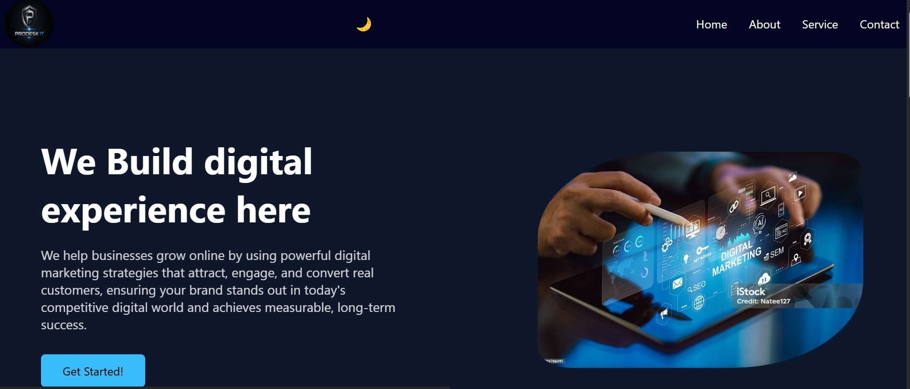
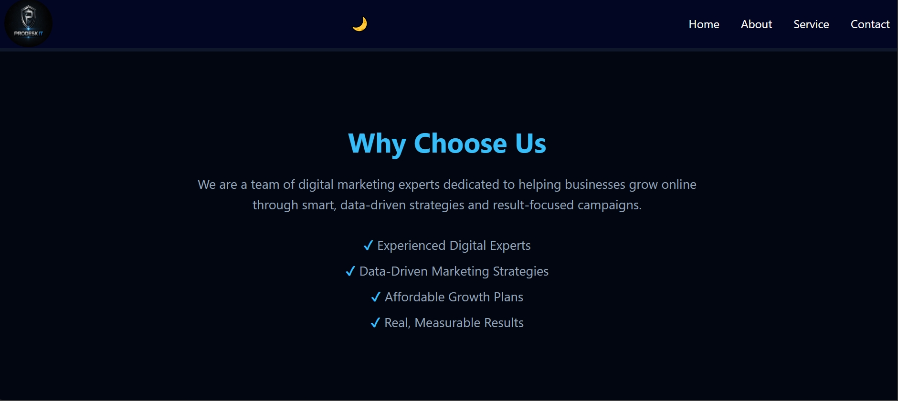
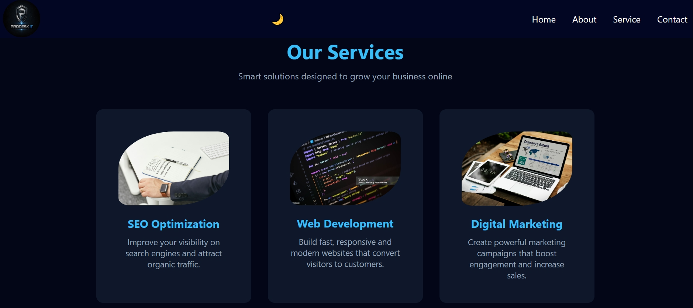
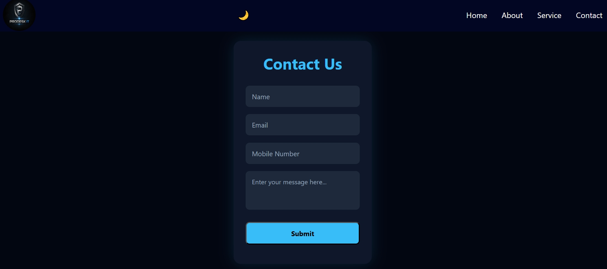

# Prodesk IT Landing Page

A clean and responsive landing page created as a Week-1 internship task to showcase the basic layout, design, and responsiveness of a corporate website.

## 🚀 Features
- Responsive landing page layout
- Modern and clean UI design
- Desktop and mobile friendly
- Structured sections (Hero, About, Services, Contact)
- Optimized for basic performance and readability

## 🛠 Tech Stack
- HTML5
- CSS3
- JavaScript
- Git & GitHub

## 📸 Screenshots
### Desktop Views

  

  

  

  

  

### Mobile View

  

## ⚙️ Installation / Usage
1. Clone the repository:
   bash
   git clone https://github.com/MSabriBoy/Prodesk_IT_LandingPage.git